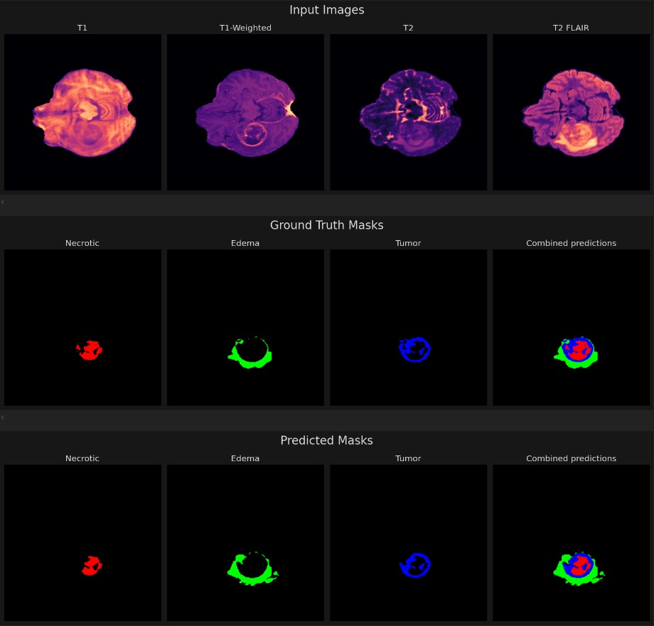

# Brain Tumor Segmentation using U-Net with Attention and Residual Layers

This repository contains a PyTorch implementation of a U-Net model designed for brain tumor segmentation using the BraTS dataset. The model architecture includes encoder and decoder blocks, a bottleneck layer, attention mechanisms, and residual connections to enhance segmentation performance.

## Features

- **Encoder Blocks**: Utilize convolutional layers with residual connections for efficient feature extraction.
- **Decoder Blocks**: Reconstruct segmented images with transpose convolutions and feature concatenations.
- **Bottleneck Layer**: Captures abstract image features before upsampling.
- **Attention Mechanisms**: Improve focus on relevant regions of the feature maps.
- **Residual Connections**: Ensure robust gradient flow and information retention across the network.

## Repository Structure

- `MyUnet.py`: Contains the implementation of the U-Net architecture.
- `model_trainer.ipynb`: Trains the model using the training data and test using testing data at the same time.
- `visualising_predictions.ipynb`: Chooses a random datapoint from the test set and plot the ground truth vs predicted labels for it.
- `Processed Data/`: Directory containing the BraTS 2021 dataset.
- `Results/`: Directory containing few images of the results obtained via the plots.
- `requirements.txt`: List of dependencies required to run the code.
- `Rename_data` : Rename all the folders from the original dataset and split into train and test data

## Dataset

- I obtained the dataset from kaggle and preprocessed it by renaming and splitting the patients into random train and test sets with 0.9 train size.
- The dataset link is : https://www.kaggle.com/datasets/dschettler8845/brats-2021-task1

## Sample 

